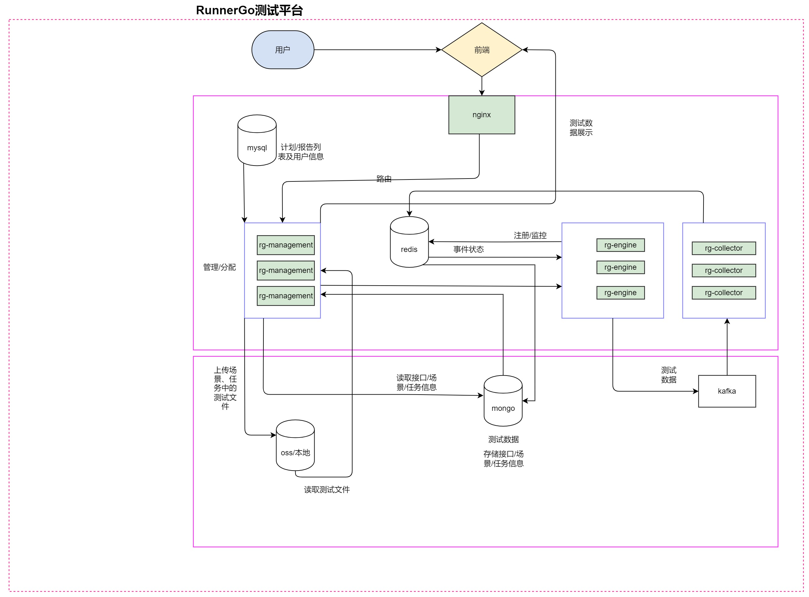

### Egg-7-week

- 消息队列：kafka
-

##### 基本原理

- 生产者 producer
- 消费者 consumer
- broker，也可以理解为消息服务器
- topic 与分区（partition）
- 消费者组与消费者

一个broker 是一个消息队列进程，一个broker是一台机器

##### topic 和 分区

一个业务就是一个topic，一个topic 有多个分区

##### 主从分区

kafka 高可用和数据不丢失，默认一主两从，消息发到kafka的时候，kafka会把消息写入主分区后，再同步到从分区。

##### 分区和broker的关系

正常情况下，同一个 topic 的分区会尽量均匀分散到所有的 broker 上。
这意味着两件事：

- 主分区之间，不会在同一个 broker 上。
- 同一个分区的主分区和从分区，也不会在同一个 broker 上。

核心目标：保证当某个 broker 崩溃的时候，对业务的影响最小。满足上面两个要求的话，某一个 broker 崩溃，最多导致 topic
的某一个主分区不可用，不至于完全不可用。

##### 分区和生产者的关系

正常情况下，一个 topic 都会有多个分区，所以发送者在发送消息的时候，就需要选择一个目标分区。
比较常用的有三种：

- 轮询：一个分区发送一次，挨个轮流。
- 随机：随机挑选一个。
- 哈希：根据消息中的 key 来筛选一个目标分区。
  也可以自己设计一些比较复杂的路由策略，用在面试中效果会比较好

##### 分区和消息有序性

Kafka 中的消息有序性保证是以分区为单位的。 也就是说，一个分区内的消息是有序的。即，消息在一个分区内的顺序，就是分区的消息被消费的顺序。
因此，如果要做到全局有序，就只能有一个分区。
如果要做到业务有序，就需要保证业务的消息都丢到同一个分区里面。
右图是一个不同分区上的消息失序的例子。生产者发送 msgA 和 msgB，但是消费者的消费顺序是 msgB、msgA

##### 分区和消费组，消费者的关系

在 Kafka 中，消费者都是归属于某一个消费者组的。
一个消费者组可以看做是关心这个 topic 的一个业务方。比如说在创建用户的时候，搜索关心新用户， 推荐也关心新用户，那么搜索自己是一个消费者组，
推荐也是一个消费者组。

同一个消费者组里面，一个分区最多只有一个消费者。
也就是在同一个消费者组里面：

- 一个消费者可以消费多个分区的数据。
- 一个分区在同一时刻，只可能被一个消费者消费。

##### 最多一个消费者的内涵：消息积压问题

一个分区最多一个消费者！
右图中分区 2 被两个消费者消费，这种是不允许的。
由此衍生出来：

- 如果一个 topic 有 N 个分区，那么同一个消费组最多有 N 个消费者。多于这个数字的消
  费者会被忽略。
- 如果消费者性能很差，那么并不能通过无限增加消费者来提高消费速率。

这就是典型的面试热点：<font color=red>消息积压问题</font>。

进入kafka 容器，查看consumer

```shell
docker ps
docker exec -it 4c803237e6d9 bash

find / -name "kafka-console-consumer.sh"

/opt/bitnami/kafka/bin/kafka-console-consumer.sh --topic test_topic --from-beginning --bootstrap-server localhost:9094
````

kafka doc

- https://kafka.apache.org/documentation/
- https://kafka.apache.org/documentation/#design # need to read
- https://kafka.apache.org/documentation/#configuration



在这张图中，数据流转涉及 **MySQL**、**Redis**、**MongoDB** 和 **Kafka** 等组件。下面将分析每个组件的作用和它们之间的关系。

### 整体架构流转

1. **用户请求**: 用户通过前端界面发起请求。
2. **Nginx**: 作为反向代理，接收用户请求并将其转发到后端服务（例如 `rg-management`）。
3. **rg-management**: 负责管理和分配任务，包括从数据库获取用户信息和任务信息。这一层可能会与 MySQL 和 Redis 进行交互。
4. **事件状态管理**: 通过 Redis 管理事件的状态，实现对任务执行过程的实时监控和控制。
5. **rg-engine**: 处理具体的测试任务，这里包含了多个实例来并行执行任务并收集结果。
6. **rg-collector**: 收集测试结果，并将其发送到 Kafka，以便后续处理。
7. **MongoDB**: 用于存储测试数据和任务信息（如接口文档、任务详情等）。
8. **OSS**: 存储上载的文件，如测试报告和其他相关文件。
9. **Kafka**: 用于处理和传输事件流，确保数据的持久性和可靠性。

### 各组件作用与区别

#### 1. MySQL

- **作用**: 用于存储结构化数据，例如用户信息、任务配置等。
- **特点**: 关系型数据库，支持 ACID 事务，适合需要复杂查询和强一致性的场景。

#### 2. Redis

- **作用**: 用作缓存和事件状态管理，提供快速的数据读写能力。
- **特点**: 内存数据库，支持高并发访问，主要用于存储临时数据或需要频繁访问的数据，如任务状态和用户会话信息。

#### 3. MongoDB

- **作用**: 用于存储非结构化或半结构化数据，例如测试记录、任务信息等。
- **特点**: 文档型数据库，灵活的数据模型，适合快速增长的动态数据需求，支持大规模数据存储。

#### 4. Kafka

- **作用**: 用于处理和传输事件流，将 `rg-collector` 收集到的测试结果异步发送到其他服务或系统进行后续处理。
- **特点**: 高吞吐量的消息队列，支持流式处理，能够保证消息的持久性和顺序性，适合处理大量实时数据。

### 总结

- **数据流转**: 用户请求经过 Nginx 转发到管理层（`rg-management`），然后管理层与 MySQL 和 Redis
  交互获取必要的信息。测试任务由 `rg-engine` 执行，结果由 `rg-collector` 收集并发送到 Kafka，最终可以存储在 MongoDB 中。
- **组件优势**: 各个组件针对不同的数据处理需求进行了优化，使用 Redis 处理状态，使用 MongoDB 存储非结构化数据，而 Kafka
  则提供了一种可靠的异步消息传递机制。


#### 已经实现的部分，存入mysql (on going)：
- User
- Note
- Api(http,websocket,RPC,TCP...)
- Task

#### 后续完成，存入mongodb (to do)：
- Task (debug)
- Api (debug)
- Task (Report)
- Api (Report)

#### 压测执行时，大量请求的状态结果，异步消息发送，kafka (to do)：
- 每个 API，每个 Task
- 结果统计后，保存 mongodb，展示最终结果

#### 数据分析与统计 (to do)：
- 分析报告
- 时段，不同字段，不同取值范围等
- 接口覆盖率统计


接口管理参考yapi:
- https://hellosean1025.github.io/yapi/documents/project.html#%e5%9f%ba%e6%9c%ac%e8%ae%be%e7%bd%ae
- https://github.com/YMFE/yapi


MQ-api 开源项目
- https://github.com/ecodeclub/mq-api